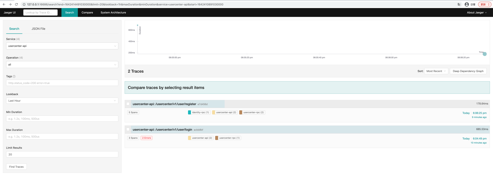

### 12. Link tracing


#### 1. Overview

If we follow the error handling and log collection configuration in the first two sections, we can see the whole link log through the traceId in the log, but it is not very convenient to see the execution time of the whole link call when no error is reported or when you want to view a single business, so it is better to add the link trace.


go-zero has already written the code to interface with the link trace for us

```go
func startAgent(c Config) error {
	opts := []sdktrace.TracerProviderOption{
		// Set the sampling rate based on the parent span to 100%
		sdktrace.WithSampler(sdktrace.ParentBased(sdktrace.TraceIDRatioBased(c.Sampler))),
		// Record information about this application in an Resource.
		sdktrace.WithResource(resource.NewSchemaless(semconv.ServiceNameKey.String(c.Name))),
	}

	if len(c.Endpoint) > 0 {
		exp, err := createExporter(c)
		if err != nil {
			logx.Error(err)
			return err
		}

		// Always be sure to batch in production.
		opts = append(opts, sdktrace.WithBatcher(exp))
	}

	tp := sdktrace.NewTracerProvider(opts...)
	otel.SetTracerProvider(tp)
	otel.SetTextMapPropagator(propagation.NewCompositeTextMapPropagator(
		propagation.TraceContext{}, propagation.Baggage{}))
	otel.SetErrorHandler(otel.ErrorHandlerFunc(func(err error) {
		logx.Errorf("[otel] error: %v", err)
	}))

	return nil
}
```

Default support for jaeger, zinpink

```go
package trace

// TraceName represents the tracing name.
const TraceName = "go-zero"

// A Config is a opentelemetry config.
type Config struct {
	Name     string  `json:",optional"`
	Endpoint string  `json:",optional"`
	Sampler  float64 `json:",default=1.0"`
	Batcher  string  `json:",default=jaeger,options=jaeger|zipkin"`
}

```


We just need to configure the parameters in our business code configuration, which is the yaml of your business configuration.


#### 2. Implementation

go-zero-looklook is implemented as jaeger

##### 2.1 jaeger

The project's docker-compose-env.yaml is configured with jaeger

```yaml
services:
    #jaeger link tracking
  jaeger:
    image: jaegertracing/all-in-one:latest
    container_name: jaeger
    ports:
      - "5775:5775/udp"
      - "6831:6831/udp"
      - "6832:6832/udp"
      - "5778:5778"
      - "16686:16686"
      - "14268:14268"
      - "9411:9411"
    environment:
      - SPAN_STORAGE_TYPE=elasticsearch
      - ES_SERVER_URLS=http://elasticsearch:9200
      - LOG_LEVEL=debug
    networks:
      - looklook_net
      
   ........
```

The jager_collector relies on elasticsearch to do the storage, so install elasticsearch, as we have demonstrated in the previous section when collecting logs.


##### 2.2 Business Configuration

Let's take user service as an example

1) api configuration

app/usercenter/cmd/api/etc/usercenter.yaml

```yaml
Name: usercenter-api
Host: 0.0.0.0
Port: 8002
Mode: dev
......

Telemetry:
  Name: usercenter-api
  Endpoint: http://jaeger:14268/api/traces
  Sampler: 1.0
  Batcher: jaeger
```

2）rpc配置

```yaml
Name: usercenter-rpc
ListenOn: 0.0.0.0:9002
Mode: dev

.....

Telemetry:
  Name: usercenter-rpc
  Endpoint: http://jaeger:14268/api/traces
  Sampler: 1.0
  Batcher: jaeger
```


##### 2.3 Viewing links

Request user service registration, login, and get login user information

Enter http://127.0.0.1:16686/search即可查看 in your browser




#### 3. Conclusion

Logs, link tracing we are finished sorting out, a good system must be able to monitor exceptions in a timely manner, the next step is to look at the service monitoring.


